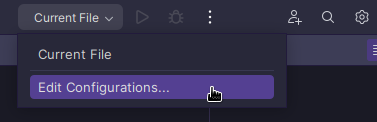
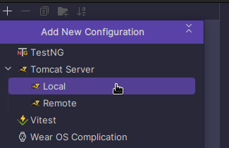
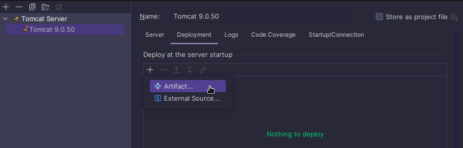
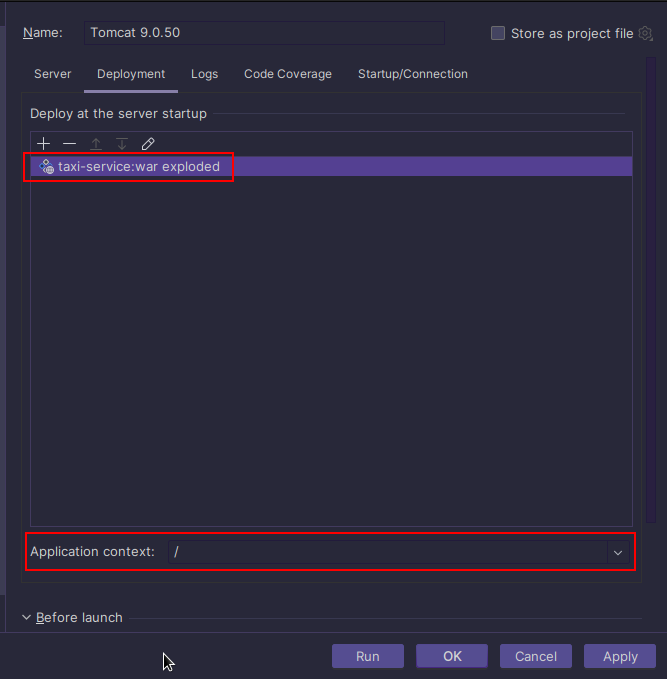
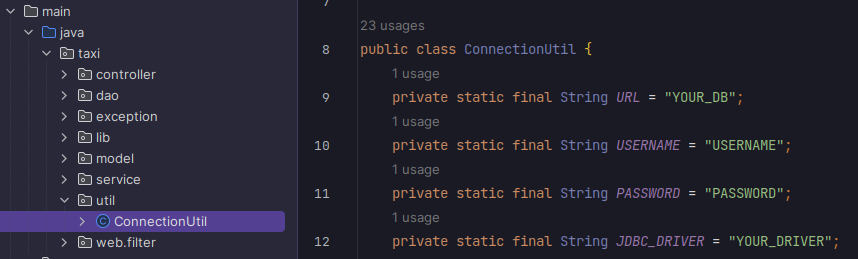
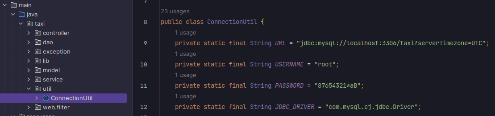

## Taxi Service
This is Web application which demonstrates basic CRUD operations, authentication and registration using MySQL and servlets, without any frameworks.

## Functionalities
- **Register:**
    - Allows users to register as new drivers.

- **Log In:**
    -  Enables users to log in to their accounts.

- **Log Out:**
    - Provides an option for users to log out from their accounts.

- **Display Lists:**
    - Show list of user's current cars.
    - Show a list of all drivers.
    - Display a list of all cars.
    - Present a list of all manufacturers.

- **Perform CRUD Operations:**
    - Create Allow users to create new drivers, cars, manufacturers.
    - Read Enable users to retrieve and view their current cars, list of all cars, drivers and manufacturers.
    - Update Allow users to assign registered drivers to existing cars.
    - Delete Provide a way for users to remove drivers, cars, manufacturers.

## Project Structure
This application consist of three layers:
1. **Controller:**  
   Handles incoming requests from users or clients.  
   Routes requests to appropriate service methods and prepares data for presentation.

2. **Service:**
   Contains business logic and application-specific rules.  
   Acts as an intermediary between the DAO layer and the Controller layer.

3. **DAO:**
   Responsible for handling database operations.  
   Uses JDBC (Java Database Connectivity) to interact with the database.  
   Focuses on data retrieval, storage, and manipulation.

## Technologies used:
- Apache Tomcat 9.0.50
- Maven 3.9.1
- Java 11
- MySQL 8.0.34
- JDBC
- Java Servlet 4.0.1,
- JSP and CSS

## Installation:
To launch the project you should follow following steps:
1. You should have `MySQL` version `8.x.x` installed on your computer (you can download it here: [MySQL downloads](https://www.mysql.com/downloads/))
2. Also you shoul have `Apache Tomcat` version `9.0.50` installed on your computer (you can download it here: [Tomcat 9.0.50](https://archive.apache.org/dist/tomcat/tomcat-9/v9.0.50/bin/))
3. Clone this repository to your local computer.
4. Open the project folder in `Intellij IDEA` IDE.
5. Set up the configuration for `Tomcat`.
   
   

   

   

   

6. Create schema in `MySQL` by executing the SQL query provided in the `init_db.sql` (which located in resources directory) file to set up the necessary tables and structure for the project.
7. Fill in the appropriate values in `ConnectionUtil class`:

   

   For example:
 
    
8. Start Tomcat:
9. Open browser and enter the address: http://localhost:8080/
